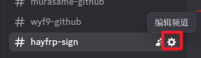
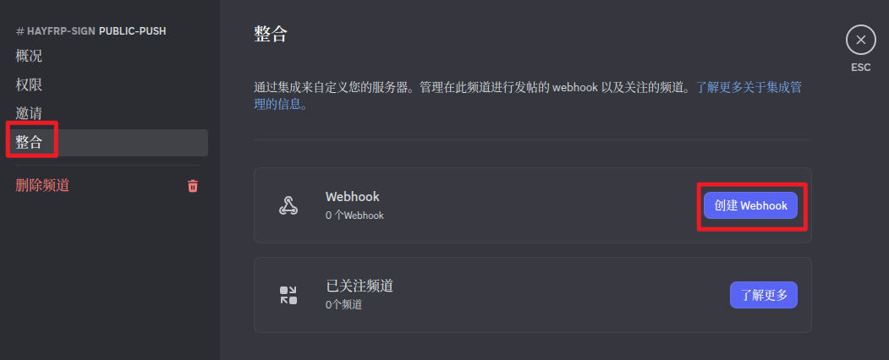
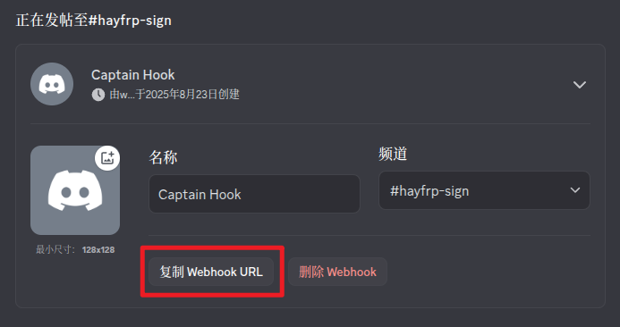

# hayfrp-auto-sign

如你所见, 这是一个 HayFrp 自动签到获取流量的 Workers 脚本.

## 部署

你需要:
- 一个 [HayFrp](https://console.hayfrp.com) 账号
- 一个 [Cloudflare](https://dash.cloudflare.com) 账号
- *一个你有创建 Webhook 权限的 Discord 频道 (可选)*

点击下面的按钮部署:

[](https://deploy.workers.cloudflare.com/?url=https://github.com/wyf9/hayfrp-auto-sign)

## 变量列表

### `WEBHOOK_URL`

> *建议配置为 Secret*

Discord Webhook 地址, 填 `disabled` 禁用 Discord 推送

<details>

<summary>获取步骤</summary>

1. 打开频道设置



2. 点击 `整合` -> `创建 Webhook`



3. 点击 `复制 Webhook URL`



</details>

### `USERS`

> *建议配置为 Secret*

你要自动签到的用户列表 (json), 使用如下格式:

```jsonc
[
    {
        "username": "wyf9", // #1 用户名
        "password": "fake-password"// #1 密码
    },
    {
        "username": "fakeuser1", // #2 用户名
        "password": "fake-password" // #2 密码
    },
    // 还可添加更多用户
]
```

### `API_URL`

HayFrp API 地址, 一般无需更改

可以在 [官方 API 文档](https://github.com/HayFrp-Team/Learn/blob/main/docs/api-doc.md) 查看最新地址

## 使用

默认在每天 `1:14` (UTC+8) 自动执行, 可以在 `wrangler.toml` 或控制台更改

Enjoy!